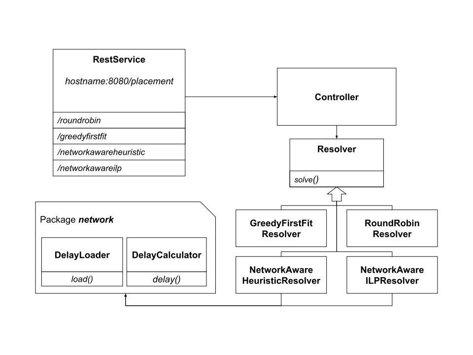

# PlacementResolver

Spring server able to solve placement of kubernetes pods on cluster nodes according to different policies:
* Round Robin
* Greedy First Fit
* Network Aware ILP
* Network Aware Heuristic

It exposes several endpoints on port 8080 to address above solving policies.


## Network-aware policies

Network-aware policies target applications which components communicate with "hubs".

These policies try to place basic components near enough to hubs in order to satisfy latency constraints.


## Overview




## Getting Started

### Installation
To run in a docker container:
```bash
make docker-run
```
To deploy as a kubernetes service:
```bash
make kube-deploy
```

### Running Example

As an example just send a POST request to a specific endpoint:
```bash
curl -d "@data/example.json" -H "Content-Type: application/json" -X POST http://localhost:8080/placement/roundrobin
```
the input data must conform to the same json format as the [example](data/example.json) file:
```json
{
  "nodes": [
    {
      "name": "controller-usc-0",
      "memAvail": 16568090624,
      "cpuAvail": 5,
      "podsInNode": ["gateway-xxxx-yyyy-12345"]
    },
    {
      "name": "worker-euw-0",
      "memAvail": 16568090624,
      "cpuAvail": 10,
      "podsInNode": null
    },
    {
      "name": "worker-nane-0",
      "memAvail": 16568090624,
      "cpuAvail": 20,
      "podsInNode": null
    }
  ],
  "pods": [
    {
      "name": "pod1",
      "namespace": "default",
      "UID": "ec2b9381-aaaa-4980-b835-de3c7035c3c0",
      "cpuReqs": 10,
      "cpuLimits": 10,
      "memReqs": 53477376,
      "memLimits": 53477376,
      "appName": "app"
    },
    {
      "name": "pod2",
      "namespace": "default",
      "UID": "eh2b9381-bbbb-4980-b835-de3c7035c3c0",
      "cpuReqs": 10,
      "cpuLimits": 10,
      "memReqs": 53477376,
      "memLimits": 53477376,
      "appName": "app"
    }
  ]
}
```

The result should be as the following:
```json
{
  "deployment" : [ {
    "namePod" : "pod1",
    "namespacePod" : "default",
    "nameNode" : "worker-euw-0",
    "UID" : "ec2b9381-aaaa-4980-b835-de3c7035c3c0"
  }, {
    "namePod" : "pod2",
    "namespacePod" : "default",
    "nameNode" : "worker-nane-0",
    "UID" : "eh2b9381-bbbb-4980-b835-de3c7035c3c0"
  } ]
}
```